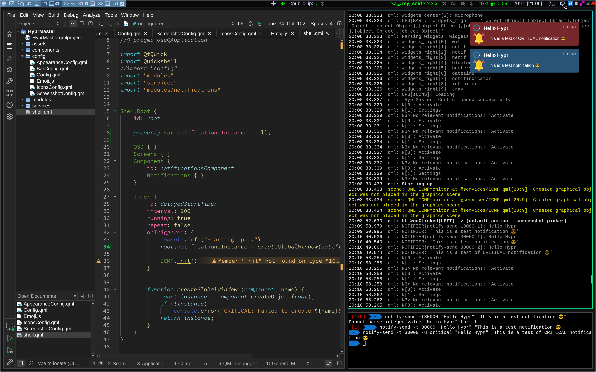
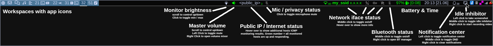
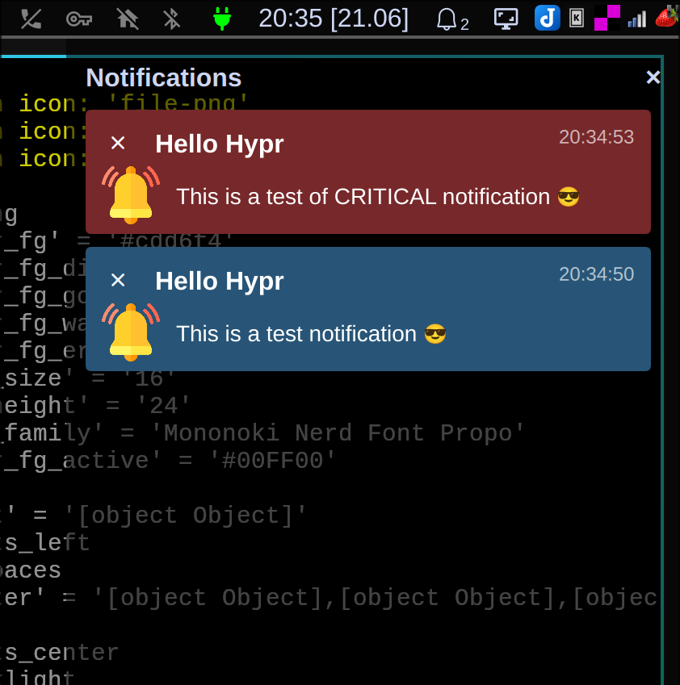
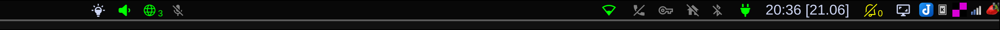

# HyprMaster



This is my feature-rich Hyprland bar in pure QuickShell.


## 📦 Main components
- Window manager: [Hyprland](https://hypr.land)
- Bar: [QuickShell](https://quickshell.org)
- QuickShell app: [HyprMaster on Gitlab](https://gitlab.com/Xoores/hyprmaster) or [Github mirror](https://github.com/xoores/HyprMaster)
- Dotfiles: [Gitlab repo](https://gitlab.com/Xoores/dotfiles) or [Github mirror](https://github.com/xoores/dotfiles/)


## 👀 Notable features
- ✏️ **JSON config** - No need to edit QML files to customize bar widgets etc
- 🤓 **Everything at a glance** - All the most important details available at all times at a glance
- 🛎️ **Notification center** - Never miss an important notification!
- 📹 **Screenshot and screen recording** - With one click you can either take a screenshot or a video recording of your desktop
- 🕵️ **Privacy first** - Microphone status and use indicator, "streamer mode" *(allows you to hide all sensitive info on your bar)*

Few years ago I was using MacOS and some of the abovementioned features are inspired by things that I liked about that system - for example the OSD or emoji support features.

All monitors have the same bar, each bar shows only workspaces on corresponding monitor.



### Notification center:



### DND / presentation mode
DND mode enabled hides all unnecessary details - can be used as a "presentation mode". Notifications are still pushed into the notification center while DND mode is enabled, so you will not miss anything:




## 📋 Prerequisites

You will need following packages (using Gentoo Portage names):

- **gui-wm/hyprland** (from [hyproverlay](https://codeberg.org/hyproverlay/hyproverlay))
- **gui-apps/quickshell** (from [GURU overlay](https://wiki.gentoo.org/wiki/Project:GURU))
- **dev-python/jc** - Converts the output of popular command-line tools and file-types to JSON, used in several network-related bar widgets
- **gui-apps/wf-recorder** - Used for screen recording functionality
- **gui-apps/grim** - for screenshot functionality
- **gui-apps/satty** (from [GURU overlay](https://wiki.gentoo.org/wiki/Project:GURU)) - for screenshot editing functionality
- **app-misc/brightnessctl**(from [GURU overlay](https://wiki.gentoo.org/wiki/Project:GURU)) - for controlling backlight


## 🔧 Installation

It should be just enough to clone the repository to your QuickShell config directory like this:

<pre>
<strong>~ $ </strong>git clone clone https://gitlab.com/Xoores/hyprmaster.git ~/.config/quickshell/HyprMaster
</pre>

or if you'd like to use github mirror of this repo:

<pre>
<strong>~ $ </strong>git clone clone https://github.com/Xoores/HyprMaster.git ~/.config/quickshell/HyprMaster
</pre>


## ⚙️ Configuration

Configuration file is a JSON-formatted file that is loaded from **.config/hyprmaster/config.json**

If you want, you can take a look at my [actual config.json](https://gitlab.com/Xoores/dotfiles/dots/.config/hyprmaster/config.json) in my dotfiles repository.

I will add a proper documentation of all the configuration options later on when the project is stable enough.

Example:
```json
{
    "#":"Any tag like this can be used as a comment - it will be ignored during parsing.",
    "#":"Not ideal but Qt evidently uses strict JSON parser, so not much I can do. Sorry.",
    "#":"",
    "#":"Global appearance settings",
    "appearance": {
        "color_fg": "#cdd6f4",
        "color_fg_disabled": "gray",
        "color_fg_good": "#00FF00",
        "color_fg_warning": "yellow",
        "color_fg_error": "#FF0000",
        "font_size": 16,
        "bar_height": 24,
        "font_family": "Mononoki Nerd Font Propo",
        "color_fg_active": "#00FF00"
    },

    "#":"General/global configuration options",
    "general": {
        "incognito_mode": false,
        "ip_resolver": "https://ip.xoor.es",
        "icmp_monitor_hosts": [
                                "google.com",
                                "nas.local"
                            ]
    },

    "icons": {
        "#":"Static workspace names",
        "workspace_icons": [
            { "id": 1,  "icon": "" },
            { "id": 3,  "icon": "" },
            { "id": 5,  "icon": "" },
            { "id": 6,  "icon": "󰝚" },
            { "id": 8,  "icon": "" }
        ],

        "#":"App icons",
        "app_icons": [
            { "class": "_default",  				"icon": "" },
            { "class": "geany",  				"icon": "" },
            { "class": "kitty",  				"icon": "" }
            ]
    },

    "widgets": {
        "#":"Widgets aligned on the left of the bar",
        "widgets_left": [
            {
                "type": "workspaces",
                "config": {
                    "padding": 5
                }
            }
        ],

        "#":"Widgets centered in the bar",
        "widgets_center": [
            {
                "type": "backlight", 
                "config": {
                    "scroll_delay": 0
                }
            },
            {
                "type": "volume",  
                "config": {
                    "on_click_right": [ "pavucontrol", "-t", "3" ]
                }
            },
            {
                "type": "inetmon",  
                "config": {
                    "interval": 5,
                }
            },
            {
                "type": "microphone",  
                "config": {
                    "on_click_right": [ "pavucontrol", "-t", "4" ]
                }
            }
        ],

        "#":"Widgets aligned on the right of the bar",
        "widgets_right": [
            {
                "type": "wifi", 
                "config": {
                    "iface": "wlan0", 
                    "icon_up": "U", 
                    "icon_down": "󰤮", 
                    "interval": 3, 
                    "show_ip": true,
                    "on_click_middle": [ "x-netif-toggle", "wifi" ]
                }
            },
            {
                "type": "bluetooth", 
                "config": {
                    "on_click": [ "blueman-manager" ],
                    "on_click_middle": [ "rfkill", "toggle", "bluetooth" ]
                }
            },
            { "type": "battery" },
            { "type": "datetime" },
            { "type": "notifindicator" },
            {
                "type": "inhibitor",  
                "config": {
                    "padding": 10
                }
            },
            { "type": "tray" }
        ] 
    }
}
```

### General config

#### incognito_mode
ℹ️ *Boolean (true / false)*

If set to true, all potentionally sensitive information is censored. This includes IP addresses (both private and public), SSID names etc.

#### ip_resolver
ℹ️ *String*

Which service is used to get public ip of our computer. Can be any web page which returns just the IP address. Effectively there is a timer (default 5s) which calls `wget [ip_resolver]` and displays the output.

If there is more than just the IP address, it will probably break the `inetmon` widget.

#### icmp_monitor_hosts
ℹ️ *Array of strings*

List of hosts that are checked with ICMP ping in `inetmon` widget.

If all hosts are up, only green number with total number of hosts is displayed. If not, the first letter of each host is displayed - either green (ok) or red (not responding).

I use this feature to monitor few relevant things at home like NAS and my docker computer. If anything goes down, I know it immediately.


### Appearance config
All values in here should be pretty self-explainatory - feel free to play around with these.


### Icons config

#### workspace_icons
ℹ️ *List of objects*

This configuration sets specified workspaces to a static icon. That means that these workspaces are always represented just by their specified icon and not by number/running applications.

You can use [Nerd Fonts Cheat Sheet](https://www.nerdfonts.com/cheat-sheet) as a nice source of icons if you use Nerd Fonts.

#### app_icons
ℹ️ *List of objects*

This configuration lets you specify icon for each app - all workspaces that are not defined through `workspace_icons` use following template: `ID [APPS]` where ID is a numeric ID of a workspace and APPS is a list of icons representing all apps on particular worskpace.

Icons are specified by application's class in lowercase and icon as a string. You can use [Nerd Fonts Cheat Sheet](https://www.nerdfonts.com/cheat-sheet) as a nice source of icons if you use Nerd Fonts.

### Widgets config
The bar is divided into 3 parts: left, middle, right and each part has corresponding array of JSON objects that represent widgets: widgets_left, widgets_center and widgets_right.

Each widget is defined like this:
```json
{
    "type": "<type_of_widget>",  
    "config": {}
}
```

Where **type** can be one of the following:
- **battery** - Battery indicator
- **bluetooth** - Bluetooth status indicator
- **backlight_ext** - Backlight control using external commands
- **backlight** - Backlight control using `app-misc/brightnessctl`
- **datetime** - Date & time
- **exec** - Execute a script & display result
- **inhibitor** - Idle inhibitor + screenshot controls
- **volume** - Volume control through native QuickShell pipewire bindings
- **microphone** - Microphone status & mute control
- **volume_ext** - Volume control using external commands
- **workspaces** - Hyprland workspaces
- **wifi** - Wifi interface status / control
- **netif** - General network interface status / control
- **notifindicator** - Notifications indicator / control center and DND controller
- **inetmon** - Network / internet state monitor
- **tray** - Xorg tray

and **config** is a list of configuration options. I will add full list later on, but for now you can take a look at my [config.json](https://gitlab.com/Xoores/dotfiles/dots/.config/hyprmaster/config.json).

Generally all modules will silently ignore unknown options and all modules have the following config options:

#### on_click / on_click_middle / on_click_right
ℹ️ *Array of strings*

These are left/middle and right click respectively. You can usually override any default action I have configured.

This parameter has to be an **array* of command and its parameters - you **cannot use single string**:

<strong>⚠️ WRONG: </strong>`"on_click": "rfkill toggle bluetooth"`

<strong>✅ CORRECT: </strong>`"on_click": [ "rfkill", "toggle", "bluetooth" ]`

#### padding
ℹ️ *Numeric value* (in pixels).

Example: `"padding": 5`

#### debug
ℹ️ *Boolean (true / false)*

Self-explainatory. Keep these disabled as some of them are quite verbose.

Example: `"debug": true`


## Issues

If you encounter any problem, you can let me know by opening [an issue on GitLab](https://gitlab.com/Xoores/hyprmaster/-/work_items/new?type=Issue).


## Special thanks

I used several projects as a "baseline" and more or less based my setup on them. I'm not a professional designer / UX expert and I have a limited time on my hands so without these awesome sources my setup would not be possible. 

I'm in no way trying to pretend that I did everything by myself and I'm the original author of everything.

Thanks for your work, could not have done this without you!

- **[caelestia-shell](https://github.com/caelestia-dots/shell)** - thanks to this repo I was able to get basic QuickShell up and running.
- **[NibrasShell](https://github.com/AhmedSaadi0/NibrasShell)** - another QuickShell setup, used as a Notifications feature baseline and then I added Notification Center on top of that (and added some features/tweaks)

I may have forgotten about some project - if that is the case, I'm sorry! Just open an issue and I'll fix it.